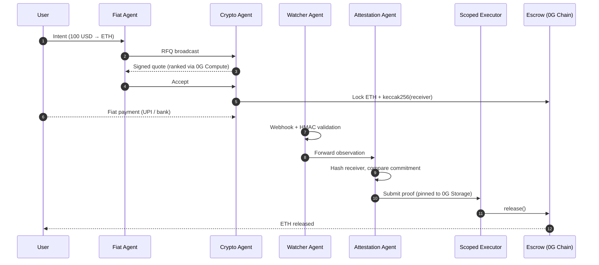

<div align="center">
  

  <h1 align="center">Beanstick</h1>

  <p align="center">
    <strong>The autonomous fiat-to-crypto settlement network.</strong><br/>
    No operators. No custodians. No centralized exchanges.
  </p>

  <p align="center">
    <a href="https://github.com/ayushkumar2601/beanstick/blob/main/LICENSE">
      
    </a>
    <a href="https://beanstick-ten-hazel.vercel.app">
      
    </a>
    <a href="#0g-apac-hackathon-2026">
      
    </a>
  </p>

  <p align="center">
    <a href="https://beanstick-ten-hazel.vercel.app"><b>Live Demo</b></a> •
    <a href="#quick-start-developer-guide"><b>Quick Start</b></a> •
    <a href="#how-it-works-the-swarm--flow"><b>How It Works</b></a> •
    <a href="docs/BIBLE.md"><b>Deep Dive (Bible)</b></a>
  </p>
</div>

---

## ⚡ What is Beanstick? (TL;DR)

**Beanstick** is the first decentralized, non-custodial fiat-to-crypto onramp operated entirely by a swarm of autonomous AI agents. 

*   🚫 **No Middlemen**: Replaces centralized exchanges (CEXs) and fiat onramp companies with verifiable agent coordination.
*   🤖 **Agentic Coordination**: Four distinct agents negotiate quotes, verify off-chain payments, and execute smart contract settlements.
*   🔒 **Zero Trust**: No single agent has the authority to move funds on its own. Funds remain in a constrained escrow contract until cryptographic proof is provided.

> [!NOTE]
> **The Core Problem:** Every fiat-to-crypto onramp today is centralized. They custody your funds, control the liquidity, demand KYC, and have the power to freeze your account. Beanstick completely removes this centralized gateway.

---

## 🧠 How It Works: The Swarm & Flow

Beanstick achieves decentralized settlement by segregating duties across four specialized agents.

### The Agent Swarm

| Agent | Role | Trust Property |
| :--- | :--- | :--- |
| 🧑‍💻 **Fiat Agent** | Acts on your behalf. Broadcasts your intent (e.g., "Buy 1 ETH") and securely ranks incoming quotes. | Holds **no custody** of your funds. |
| 🏦 **Crypto Agent** | Represents the Liquidity Provider (LP). Provides quotes and locks crypto into the escrow. | Funds are locked in **escrow**, not held by the agent. |
| 👀 **Watcher Agent** | Listens for off-chain fiat payment events (e.g., via bank APIs or UPI webhooks). | Strictly **read-only**; cannot execute transactions. |
| ⚖️ **Attestation Agent** | Verifies Watcher observations against on-chain commitments and triggers release. | Cannot fabricate evidence or bypass logic. |

### End-to-End Workflow

> **Scenario:** You want to swap **100 USD** for **ETH**.



> [!IMPORTANT]
> **Key Security Primitive:** *Receiver Commitment Binding.*
> When the Crypto Agent locks funds, it commits a hash: `keccak256(paymentReceiver)`. The escrow only releases funds if the Attestation Agent proves the final payment was made to that *exact* receiver. 

---

## 🕸️ AuraDB Trust Infrastructure

Beanstick is powered by **AuraDB**, serving as the production graph infrastructure layer for real-time trust-aware settlement decisions. By continuously modeling the network of users, LPs, and settlements as a graph, the system establishes a decentralized web of trust without relying on a central authority.

**Why AuraDB?**
- **Graph Intelligence:** Neo4j's AuraDB allows Beanstick to evaluate multi-hop trust relationships (e.g. "Trusted by trusted participants") which is impossible in flat relational schemas.
- **Fraud Detection:** Detects complex reputation manipulation like circular trading (A -> B -> C -> A) and dense isolated LP rings.
- **Trust Propagation:** Generates real-time reputation scores based on settlement reliability, total volume, and network trust propagation.
- **Risk-Aware Quoting:** Fiat agents don't just pick the cheapest quote—they evaluate `(Price) + (AuraDB Trust Score)` to securely route liquidity.

```text
User
 ↓
Sarvam AI
 ↓
Fiat Agent
 ↓
AuraDB Trust Layer
 ↓
Quote Selection
 ↓
Escrow
 ↓
Settlement
```

---

## 🌐 Powered by the 0G Stack

Beanstick is built natively on the 0G modular AI x Web3 stack. Every layer relies on a 0G primitive for security, speed, and privacy.

*   ⛓️ **0G Chain**: Agents are minted as iNFTs (ERC-7857) with embedded intelligence. The Escrow contract handles the deterministic release of funds.
*   🗄️ **0G Storage**: Provides KV memory for real-time agent state and Log memory for settlement history. Data is encrypted and Merkle-rooted.
*   🧠 **0G Compute**: Executes **sealed inference** (TEE-attested LLM calls) for private quote ranking and counterparty reputation scoring.

---

## 🚀 Quick Start (Developer Guide)

Get the Beanstick monorepo up and running locally in a few minutes.

### Prerequisites
- [Node.js](https://nodejs.org/) (v18+)
- [pnpm](https://pnpm.io/) (v9+)
- [Foundry](https://getfoundry.sh/) (for smart contract compilation)

### 1. Clone & Install

```bash
git clone https://github.com/ayushkumar2601/beanstick.git
cd beanstick
pnpm install
```

### 2. Environment Setup

Copy the example environment file and fill in your keys (RPC URLs, Private Keys, Webhook Secrets).

```bash
cp .env.example .env
```

### 3. Run the Network

You can boot up the entire agent swarm, webhook receiver, and frontend using the provided script:

```bash
./start-all.sh
```

*(Alternatively, run them separately in different terminal windows: `pnpm run agent-server`, `pnpm run webhook-receiver`, and `pnpm dev`)*.

### 4. Smart Contracts (Foundry)

If you need to deploy or test the core protocol contracts on a local anvil node or testnet:

```bash
cd contracts
forge build
forge test
# Deploy to network
forge script script/Deploy.s.sol --rpc-url $RPC_URL --broadcast
```

---

## 📂 Repository Structure

The monorepo is cleanly separated into microservices, apps, and protocol logic:

```text
beanstick/
├── agents/       # Core logic for the 4 autonomous agents + shared runtime
├── apps/         
│   └── web/      # Main user-facing Next.js frontend application
├── contracts/    # Foundry project containing Solidity smart contracts
├── protocol/     # Protocol definitions (Axelar, MCP, HTTP 402)
├── services/     # Backend microservices (e.g., agent-server)
├── keepers/      # Background cron jobs and automated workflows
└── zerog/        # 0G network-specific integrations (Storage, Compute)
```

---

## 🏆 0G APAC Hackathon 2026

Beanstick is an official submission for the **0G APAC Hackathon (2026)**.

> Beanstick uses AuraDB as its production graph infrastructure to power real-time trust-aware settlement decisions.

*   **Target Track**: Track 3 (Agentic Economy & Autonomous Applications) with relevance to Verifiable Finance.
*   **Graph Technology**: Uses **AuraDB** to model decentralized trust, trust propagation, risk-aware liquidity routing, and fraud detection.
*   **Live Demo**: [beanstick-ten-hazel.vercel.app](https://beanstick-ten-hazel.vercel.app)
*   **On-Chain Activity**: View our deployed Escrow on Ethereum Sepolia: `0x04baE2732D5A26cd70d26E40a9196396E9a49aC0`.

---

<div align="center">
  <p>Built with ❤️ by <strong>Arko Roy</strong></p>
  <p>
    <a href="https://t.me/arkoxo">Telegram</a> • 
    <a href="https://x.com/notarkoroy">X (Twitter)</a>
  </p>
  <p>Licensed under <b>MIT</b>.</p>
</div>
