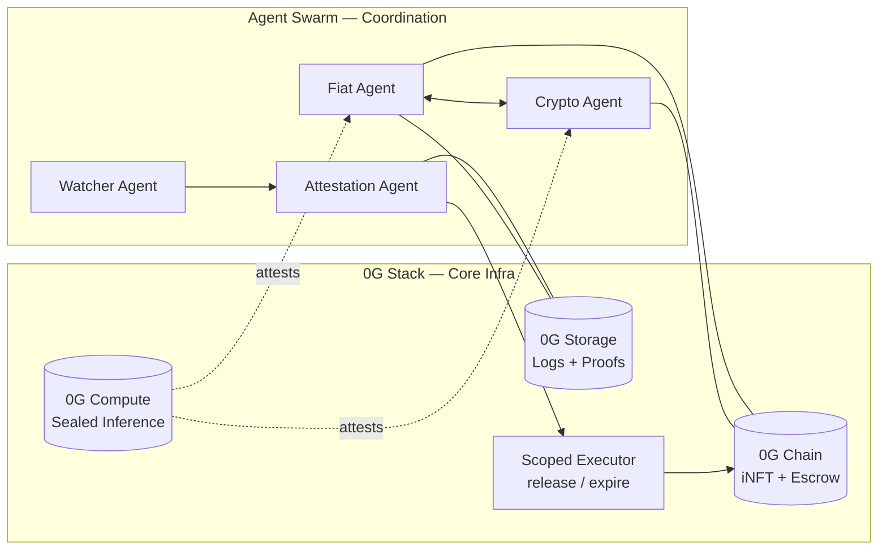
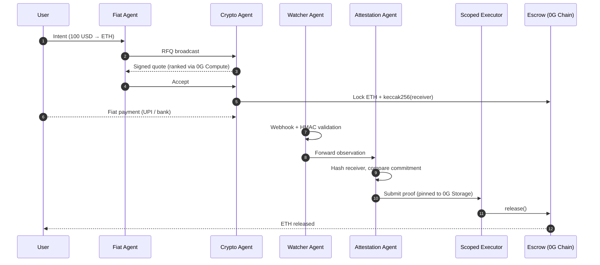

<p align="center">
  
</p>

<h1 align="center">Beanstick (Project Bible)</h1>

<p align="center">
  <strong>The first fiat-to-crypto onramp with no operator</strong><br/>
  Autonomous agents. No custodians. No central coordinator.
</p>

<p align="center">
  
  
  
  
</p>

<p align="center">
  <a href="https://beanstick-ten-hazel.vercel.app">Live Demo</a> ·
  <a href="#how-it-works">How It Works</a> ·
  <a href="#architecture--the-0g-stack">Architecture</a> ·
  <a href="#local-development--deployment-guide">Run Locally</a>
</p>

---

## Table of Contents
1. [Executive Summary](#executive-summary)
2. [The Core Problem](#the-core-problem)
3. [Architecture & The 0G Stack](#architecture--the-0g-stack)
4. [The Autonomous Agent Swarm](#the-autonomous-agent-swarm)
5. [End-to-End Settlement Workflow](#end-to-end-settlement-workflow)
6. [Key Security Primitive](#key-security-primitive)
7. [Project Directory Structure](#project-directory-structure)
8. [Smart Contracts](#smart-contracts)
9. [Local Development & Deployment Guide](#local-development--deployment-guide)
10. [0G APAC Hackathon Details](#0g-apac-hackathon-details)

---

## Executive Summary

Beanstick is a decentralized, non-custodial fiat-to-crypto onramp. It completely removes the need for a centralized operator or centralized exchange to facilitate fiat transactions. Instead, Beanstick relies on a swarm of four specialized autonomous agents (Fiat, Crypto, Watcher, Attestation) that coordinate peer-to-peer to negotiate quotes, verify off-chain payments, and execute on-chain settlements. 

Because of its constrained execution boundary and strict segregation of duties, **no single agent can move funds alone**. The system is built end-to-end on the **0G modular AI x Web3 stack**.

---

## The Core Problem

Every fiat-to-crypto onramp today is centralized. They custody funds, control liquidity, and have the power to freeze accounts. 

> **The gateway to decentralization is still centralized.**

Beanstick removes that gateway. By replacing human operators and centralized liquidity pools with verifiable agent coordination and constrained smart contract execution, it provides a truly decentralized pathway from fiat directly to crypto.

---

## Architecture & The 0G Stack

Beanstick is built natively on the 0G stack. Every layer of the system depends on a 0G primitive to function securely and privately.

| 0G Layer | How Beanstick Uses It |
|---|---|
| **0G Chain** | Agents are minted as iNFTs (ERC-7857) with embedded intelligence. An escrow contract enforces `keccak256(receiver)` commitments and handles deterministic release of funds. |
| **0G Storage** | Provides KV memory for real-time agent state and Log memory for full settlement history. Decision logs, quote history, and LP reputation are encrypted, Merkle-rooted, and stored here. |
| **0G Compute** | Executes sealed inference (TEE-attested LLM calls) for quote ranking and counterparty reputation scoring. Agent binary attestation prevents tampering and front-running. |
| **Agent Identity**| Each agent has a persistent identity bound to its iNFT on 0G Chain. |

### Component Flow



---

## The Autonomous Agent Swarm

The system is powered by four distinct agents. Each possesses structurally different powers to ensure security through segregation of duties.

| Agent | Role | Trust Property |
|---|---|---|
| **Fiat Agent** | Acts on behalf of the user. Broadcasts the intent (e.g., "I want to buy 1 ETH"), receives quotes from liquidity providers, and selects the best one. | Holds no custody of funds. |
| **Crypto Agent** | Represents the Liquidity Provider (LP). Provides quotes, locks crypto into the escrow contract. | Funds are locked in escrow, not held by the agent. |
| **Watcher Agent** | Listens for off-chain fiat payment events (e.g., via webhooks from bank APIs or UPI). | Strictly read-only; cannot execute transactions. |
| **Attestation Agent** | Takes observations from the Watcher, verifies them against the on-chain commitment, and triggers the final release. | Cannot fabricate evidence or bypass the escrow logic. |

---

## End-to-End Settlement Workflow

> **Scenario:** A user wants to swap **100 USD** for **ETH**.

1. **Connect & Init**: The user connects their wallet and initializes a session. Their Fiat Agent comes online.
2. **Quote Discovery**: The Fiat Agent broadcasts a Request for Quote (RFQ). Various Crypto Agents (LPs) reply with signed quotes.
3. **Sealed Ranking**: The Fiat Agent uses 0G Compute (sealed inference) to securely rank the quotes and select the best one deterministically.
4. **Escrow Lock**: The winning Crypto Agent locks the agreed amount of ETH into the 0G Escrow smart contract. Crucially, it also commits a hash of the payment receiver: `keccak256(paymentReceiver)`.
5. **Fiat Payment**: The user makes the off-chain fiat payment (e.g., via UPI).
6. **Observation**: The Watcher Agent receives a webhook confirming the payment, validates its HMAC signature, and passes the observation to the Attestation Agent.
7. **Verification**: The Attestation Agent hashes the observed receiver details and checks if they match the `keccak256` commitment locked in the escrow contract.
8. **Settlement**: If the hashes match, the proof is pinned to 0G Storage. The scoped executor calls `release()` on the smart contract, transferring the ETH to the user.



---

## Key Security Primitive

The most critical security feature of Beanstick is the **Receiver Commitment Binding**. It prevents bait-and-switch attacks and spoofing.

```text
At lock time:    commitment = keccak256(paymentReceiver)
At verify time:  keccak256(observedReceiver) == commitment ?
```

If a malicious watcher tries to submit a payment made to a different account, the hashes will not match, and the smart contract will reject the release.

---

## Project Directory Structure

The repository is organized as a monorepo encompassing the agents, smart contracts, frontend, and backend services.

*   `agents/`: Contains the core logic for the four autonomous agents (`fiat-agent`, `crypto-agent`, `watcher-agent`, `attestation-agent`) and their shared `runtime`.
*   `apps/`: Contains the user-facing web applications.
    *   `apps/web/`: The main React/Next.js frontend.
*   `contracts/`: A Foundry project containing all smart contracts.
    *   `src/`: The Solidity source code.
    *   `script/`: Deployment scripts.
*   `services/`: Backend microservices.
    *   `services/agent-server/`: The Node.js server that hosts and manages the agent lifecycles.
*   `protocol/`: Core protocol definitions and cross-chain/standard integrations.
    *   `axl/`: Axelar integration logic.
    *   `mcp/`: Model Context Protocol definitions.
    *   `x402/`: HTTP 402 (Payment Required) standard implementations.
*   `keepers/`: Background workers for maintenance.
    *   `jobs/` & `workflows/`: Cron jobs and automated tasks.
*   `zerog/`: 0G network specific integrations.
    *   `compute/`: Interfaces for 0G Compute (sealed inference).
    *   `storage/`: Interfaces for 0G Storage (KV and Logs).

---

## Smart Contracts

The on-chain components are deployed on the 0G Chain.

| Contract | Purpose |
|---|---|
| **Escrow** | Handles the locking and release of funds. Enforces the `keccak256` commitment check. Only the scoped executor can trigger `release()` or `expire()`. |
| **AgentRegistry** | Manages the public keys and operational status of active agents. |
| **RailRegistry** | Manages configurations for different fiat payment rails (e.g., UPI, SEPA). |
| **AgentINFT** | Implementation of ERC-7857. Mints agents as intelligent NFTs on the 0G Chain. |
| **TestERC20** | A mock token used for testing local liquidity and swaps. |

**Deployed Addresses (0G Testnet)**
*   Escrow: `0xeAD29cBfAb93ed51808D65954Dd1b3cDDaDA1348`
*   AgentRegistry: `0x2E124DEaeD3Ba3b063356F9b45617d862e4b9dB5`
*   RailRegistry: `0x0a22b6e2f0ac6cDA83C04B1Ba33aAc8e9Df6aed7`
*   AgentINFT: `0xBf173825A08a98a0288923d00919daC13C94C70A`

---

## Local Development & Deployment Guide

### Prerequisites
*   [Node.js](https://nodejs.org/) (v18+)
*   [pnpm](https://pnpm.io/) (v9+)
*   [Foundry](https://getfoundry.sh/) (for smart contracts)

### Setup

1. **Clone the repository:**
   ```bash
   git clone https://github.com/arko05roy/Beanstick.git
   cd Beanstick
   ```

2. **Install dependencies:**
   ```bash
   pnpm install
   ```

3. **Configure Environment:**
   Copy the example environment file and fill in your RPC URLs, private keys, and webhook secrets.
   ```bash
   cp .env.example .env
   ```

### Running the System

You can use the provided bash script to start all services, or run them individually.

**Option A: Start everything (Recommended)**
```bash
./start-all.sh
```

**Option B: Manual Start**
1. Start the agent server:
   ```bash
   pnpm run agent-server
   ```
2. Start the webhook receiver (for the Watcher Agent):
   ```bash
   pnpm run webhook-receiver
   ```
3. Start the frontend:
   ```bash
   pnpm dev
   ```

### Smart Contract Deployment

Navigate to the `contracts` directory to run tests or deploy to a live network.

```bash
cd contracts
forge build
forge test
forge script script/Deploy.s.sol --rpc-url $RPC_URL --broadcast
```

---

## 0G APAC Hackathon Details

Beanstick was built for the **0G APAC Hackathon 2026**.
*   **Track**: Track 3: Agentic Economy & Autonomous Applications (with crossover to Verifiable Finance).
*   **Live Demo**: [https://beanstick-ten-hazel.vercel.app](https://beanstick-ten-hazel.vercel.app)
*   **On-Chain Activity**: View the Escrow contract `0xeAD29cBfAb93ed51808D65954Dd1b3cDDaDA1348` on the 0G Block Explorer.

**Why Beanstick fits 0G:** Without 0G's storage for verifiable memory, compute for sealed inference, and chain for iNFTs/Escrow, this decentralized coordination would be impossible to secure.

---

## License

MIT License.

---

<p align="center">Built by <strong>Arko Roy</strong> — <a href="https://t.me/arkoxo">Telegram</a> · <a href="https://x.com/notarkoroy">X</a></p>
