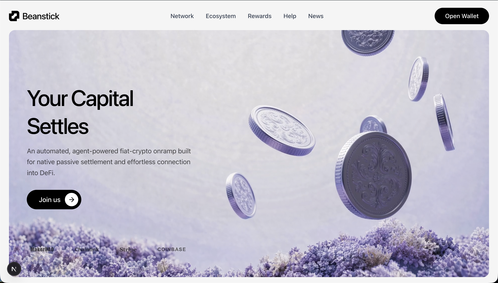
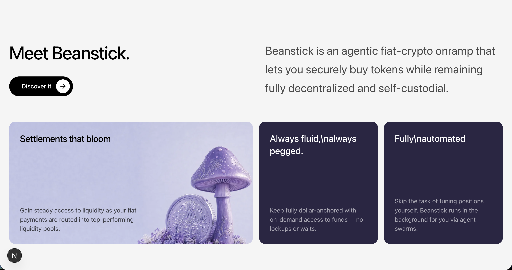
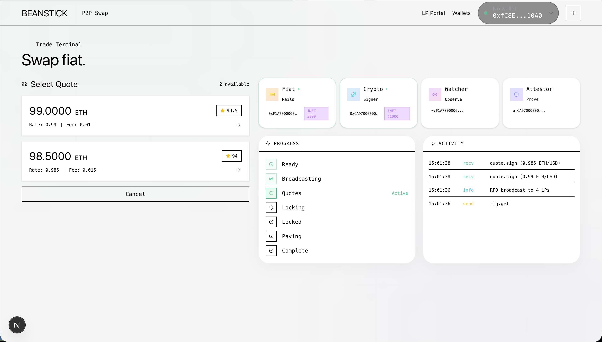
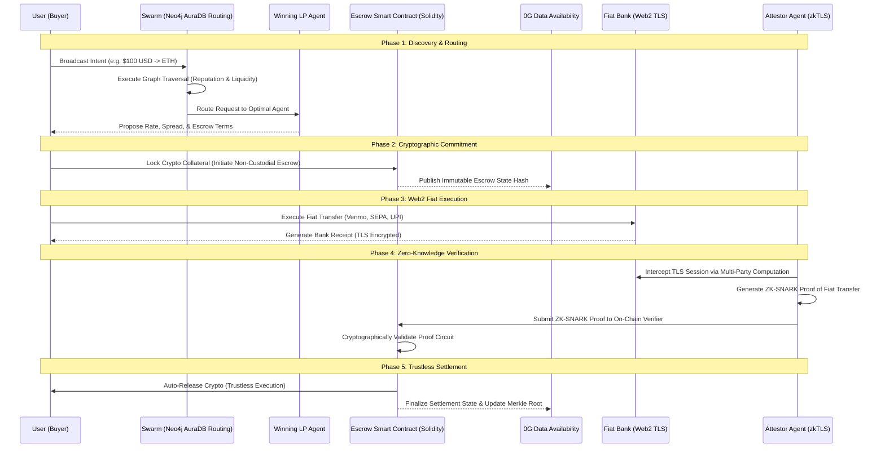

<div align="center">
  <h1 align="center">Beanstick</h1>
  <p align="center">
    <strong>The autonomous fiat-to-crypto settlement network.</strong><br/>
    No operators. No custodians. No centralized exchanges.
  </p>
</div>

---

## 🏆 HackHazards Hackathon

**Beanstick** was proudly built by **Ayush Kumar** for the **HackHazards Hackathon**. 
This project aims to revolutionize decentralized finance by creating a trustless, agentic fiat-crypto onramp powered by artificial intelligence, zero-knowledge proofs, and highly scalable databases.

---

## 📸 Project Showcase

Here is a look at the premium, fintech-grade interface built for Beanstick:

<div align="center">
  
  <br/><br/>
  
  <br/><br/>
  
</div>

---

## 🌟 About Beanstick

Today, moving money between traditional banking and crypto is broken. It requires centralized custodians, invasive KYC, high fees, and days of waiting. 

Beanstick solves this by acting as a decentralized network of autonomous Liquidity Provider (LP) agents. When you want to buy crypto, you trade with a decentralized network of agents competing to give you the best rate. 

### Key Features
- **Fully Automated:** Smart agents handle the quoting, locking, and releasing of escrow funds automatically.
- **Zero Counterparty Risk:** Smart contracts ensure your crypto is only released upon cryptographically verified proof of fiat transfer.
- **zkTLS Verification:** Bank transfers are verified securely and privately in real-time.
- **Premium Fintech UI:** A sleek, user-friendly interface designed for mass adoption.

---

## 🚀 Powered by Neo4j AuraDB

A critical component of Beanstick's architecture is its ability to map, analyze, and route complex liquidity graphs in real-time. 

To achieve this, Beanstick utilizes **Neo4j AuraDB** as its core graph database engine.

### How we use Neo4j AuraDB:
1. **Agent Reputation Graph:** We model every LP agent, user, and historical transaction as nodes and relationships. AuraDB allows us to instantly calculate trust scores and reputation metrics by traversing the transaction history graph.
2. **Liquidity Routing:** When a user requests a fiat-to-crypto quote, AuraDB executes lightning-fast graph algorithms to find the most optimal, low-fee liquidity paths across thousands of active agents.
3. **Fraud Detection:** By analyzing patterns in the network (e.g., linked wallets, rapid failed transactions), our graph queries detect and flag suspicious agent rings in real-time, protecting the ecosystem from malicious actors.

Neo4j AuraDB's fully managed cloud infrastructure ensures that Beanstick's agent swarm can query these complex relationships with sub-millisecond latency, providing a seamless user experience.

---

## ⚙️ Deep-Dive Technical Documentation

Beanstick operates on a highly complex, multi-layered architecture designed to solve the "trust" problem inherent in Web2-to-Web3 bridges. By combining a **Decentralized Agentic Swarm Protocol**, **zkTLS (Zero-Knowledge Transport Layer Security) Verification**, and **0G Data Availability (DA)**, we achieve a strictly non-custodial, trustless execution environment that completely eliminates counterparty risk.

### 1. The Agentic Swarm Protocol Layer

Traditional P2P exchanges rely on centralized order books or static liquidity pools (AMMs). Beanstick introduces an autonomous **Agentic Swarm Protocol**.

- **Swarm Dynamics:** The network consists of thousands of independent Liquidity Provider (LP) AI agents. These agents run lightweight Node.js instances connected to their own Web2 banking APIs (e.g., Plaid, Stripe) and Web3 hot wallets.
- **Dynamic Quoting:** When a user requests a settlement (e.g., USD to ETH), the swarm executes an English-style reverse auction in milliseconds. Agents analyze the user's intent, their own liquidity reserves, and network gas fees to generate real-time, highly competitive quotes.
- **Neo4j Graph Routing Heuristics:** To prevent spam and ensure the user receives the best quote from a *reliable* agent, Beanstick utilizes **Neo4j AuraDB**. We run the `PageRank` and `Betweenness Centrality` algorithms across the Agent Reputation Graph. Only agents with high trust scores and successful historical settlement paths are allowed to win the auction.

### 2. Architectural Workflow Diagram

The following sequence illustrates the complex lifecycle of a Decentralized Settlement Network (DSN) transaction:



### 3. Non-Custodial Smart Contract Escrow (Layer 1 / Layer 2)

The escrow logic is enforced via highly optimized Solidity smart contracts.

- **Deterministic Locking Mechanism:** When an agreement is reached, the LP agent locks the agreed-upon cryptocurrency into the Escrow Contract. The contract locks the funds with a strict `block.timestamp` deadline.
- **State Transition Machine:** The contract operates as a strict finite-state machine (FSM) traversing: `INITIATED` -> `LOCKED` -> `AWAITING_PROOF` -> `RELEASED` or `REFUNDED`.
- **Zero-Trust Release:** No admin, multisig, or central authority can move the funds. The `release()` function requires a valid ZK-SNARK cryptographic proof as its sole parameter. If the proof is valid, the funds route to the user. If the deadline expires without a valid proof, the `refund()` function safely returns the capital to the LP.

### 4. zkTLS: Bridging Web2 and Web3

The most critical innovation in Beanstick is bridging the Web2 banking system with Web3 smart contracts without relying on centralized oracles like Chainlink.

- **Multi-Party Computation (MPC):** Attestor agents act as a proxy between the user and the bank's HTTPS server. They split the TLS session keys using MPC. This allows the Attestor to verify the exact HTML/JSON response from the bank (proving the fiat transfer occurred) *without* ever seeing the user's login credentials or sensitive PII.
- **ZK-SNARK Generation:** The Attestor generates a concise Zero-Knowledge Proof (ZK-SNARK) asserting: "A transfer of $100 to the LP's account was successful." This proof is tiny (a few hundred bytes) and takes milliseconds to verify on-chain.

### 5. Infinite Scalability via 0G Data Availability

Storing complex agent attestations, cryptographic proofs, and settlement states directly on Layer 1 (Ethereum) would result in exorbitant gas fees. 

- **Data Sharding:** Beanstick anchors all high-throughput, non-consensus critical data to the **0G Data Availability (DA)** layer. 
- **Merkle Roots:** We batch thousands of settlement states into a single Merkle Tree and post only the Merkle Root to the Layer 1 smart contract. This provides Layer 1 security guarantees with Layer 2 costs, allowing the agent swarm to process millions of micro-transactions per second.

---

## 🛠 Tech Stack

- **Frontend:** React, Next.js, Tailwind CSS, Framer Motion
- **Blockchain / Smart Contracts:** Solidity, 0G Network, Sepolia Testnet
- **Database / Analytics:** Neo4j AuraDB
- **Agents:** Custom AI swarm architecture

---

## 💻 Getting Started

### Prerequisites
- Node.js (v18+)
- pnpm
- A valid Neo4j AuraDB URI and credentials

### Installation
1. Clone the repository:
   ```bash
   git clone https://github.com/ayushkumar2601/beanstick.git
   cd beanstick
   ```
2. Install dependencies:
   ```bash
   pnpm install
   ```
3. Setup environment variables:
   Create a `.env` file and add your configuration (including your Neo4j credentials).
4. Run the development server:
   ```bash
   pnpm --filter web run dev
   ```
5. Open `http://localhost:3000` to view the application.

---

<div align="center">
  <p>Built with ❤️ by Ayush Kumar for HackHazards</p>
</div>
